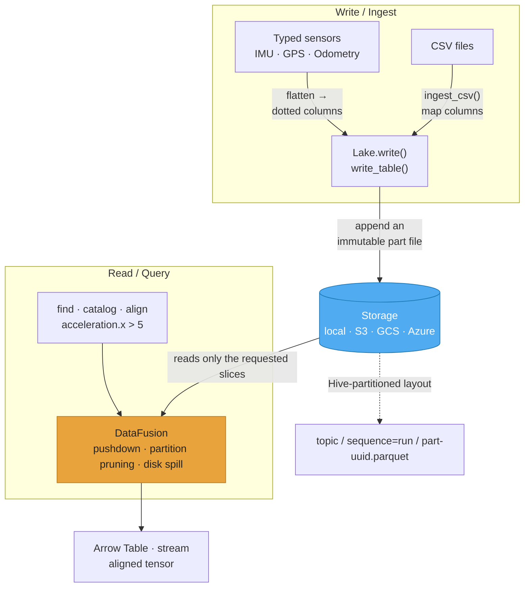
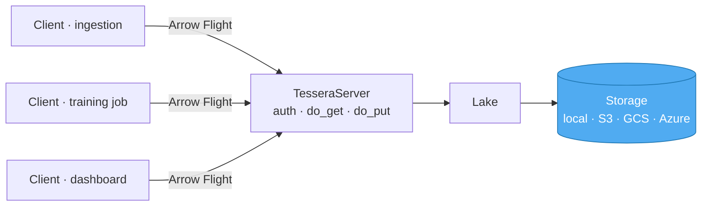

<p align="center">
  
</p>

<h1 align="center">Tessera</h1>
<h2 align="center">A minimal data layer for Physical AI</h2>

<p align="center">
  <a href="https://github.com/silviorevelli/tessera-physical/actions/workflows/ci.yml"></a>
  
  
  
  
  
</p>

Tessera is a small data layer for sensor and time-series data. It stores records as
partitioned [Apache Parquet](https://parquet.apache.org/) files and queries them with
[Apache DataFusion](https://datafusion.apache.org/). It can be used as an in-process
Python library or as a networked service over [Apache Arrow Flight](https://arrow.apache.org/docs/format/Flight.html).

The design goal is to keep the moving parts to a minimum: the storage format and the
query engine are standard, open components, and the library is a thin layer over them.
Data is written as ordinary Parquet files, so it can also be read by other tools
(pandas, Polars, DuckDB, Spark, …) without going through Tessera.

## Contents

- [Overview](#overview)
- [Why less is more](#why-less-is-more)
- [Architecture](#architecture)
- [Installation](#installation)
- [Data model](#data-model)
- [Usage](#usage)
- [Scaling](#scaling)
- [Server and clients](#server-and-clients)
- [Interoperability](#interoperability)
- [Status and limitations](#status-and-limitations)
- [Examples](#examples)
- [Testing](#testing)
- [Acknowledgements](#acknowledgements)
- [License](#license)
- [Citation](#citation)

## Overview

A typical workflow:

1. **Write** sensor records into a *sequence* (one recording/run) under a *topic*
   (one signal type, e.g. `imu`).
2. **Query** by physical value across sequences (e.g. `acceleration.x > 5`); the query
   engine reads only the relevant Parquet row groups and partitions.
3. **Align** several sensors sampled at different rates onto a fixed-frequency grid,
   producing a dense table suitable for model training.

Key properties:

- **Columnar Parquet storage**, with predicate pushdown and partition pruning so queries
  read only the data they need.
- **Typed ontology**: small dataclasses describe each sensor; nested fields flatten to
  dotted column names (`acceleration.x`), stored as ordinary Parquet columns.
- **Append-only layout**: each write produces a new immutable part file, so multiple
  writers can run in parallel and history is reproducible.
- **Out-of-core execution**: a bounded memory pool with disk spill handles datasets
  larger than RAM.
- **Local or object-store storage**: a local folder or `s3://`, `gs://`, `az://`.
- **CSV ingest**: read CSV exports into the same Parquet part files.
- **Fixed-frequency alignment** for ML: a zero-order-hold join over DataFusion.
- **Optional server**: an Arrow Flight service exposes one lake to multiple clients,
  with API-key authentication.

## Why less is more

Every sensor-data tool for robotics ends up standing on the same two open foundations: a
columnar format that stores the data, and a query engine that searches it. That's the
substance, and it's shared — nobody owns it, everybody builds on it.

So the real difference between tools isn't the engine. It's how much they wrap around it.
The usual approach adds a proprietary layer on top — a server you must run, a database
that holds your metadata, a network protocol between you and your own files. That layer is
what you end up paying for, deploying, monitoring, and depending on. And it's what locks
you in: the day you stop using the tool, you need the tool just to read what you recorded.

Tessera keeps the foundations and throws away the wrapper. The result isn't "fewer
features" — it's the same power, with three advantages that only show up once the
proprietary layer is gone:

- **Your data outlives the tool.** Everything is written as plain Parquet files, the
  format read by pandas, Polars, DuckDB, Spark, BigQuery, and the rest of the ecosystem.
  Delete Tessera tomorrow and your recordings stay perfectly readable. There is no secret
  format that needs us to decode it. It's yours, not ours.
- **Nothing to run, until you want to.** By default Tessera is a library: you import it
  and call a function — no daemon to keep alive, no database to sync, no port to secure.
  The worst thing that can break is "the file isn't there." When you genuinely need many
  clients sharing one lake over the network, there's an optional server — and even that
  speaks a standard open protocol (Arrow Flight), so it adds reach without adding lock-in.
- **Small enough to read in an afternoon.** The whole thing is a thin layer on top of the
  two engines. You can read every line, understand exactly what happens to your data, and
  change it. There's no large proprietary system to trust on faith — because there's
  almost no proprietary system at all.

The honest trade-off: if what you need is a heavyweight managed service with built-in user
accounts and an always-on platform team behind it, that's a different kind of product. But
if what you need is to store and query sensor data at scale, from code, and keep full
ownership of it — that's exactly what Tessera does, on open foundations, with nothing
standing between you and your files.

> In one line: the usual platforms sell you the infrastructure around the data. Tessera
> leaves you the data.

## Architecture



Typed sensors (or CSV files via `ingest_csv`) are flattened into columns and written as
immutable Parquet part files. On read, DataFusion scans only the necessary partitions and
row groups and returns an Arrow table, a stream of record batches, or an aligned tensor.
The two underlying components are Parquet (storage) and DataFusion (query); the library
is the layer that connects them.

## Installation

```bash
pip install pyarrow datafusion pandas
```

`pandas` is optional and only used to pretty-print results in the examples.

## Data model

**Topics and sequences.** A *topic* is a signal type (`imu`, `gps`, `odometry`). A
*sequence* is one recording/run (`run01`). Data is stored as:

```
datalake/
  imu/
    sequence=run01/  part-3f9a….parquet  part-7c2b….parquet
    sequence=run02/  part-a18e….parquet
  gps/
    sequence=run01/  part-0b44….parquet
```

This is a Hive-style partitioned layout. The sequence is encoded in the directory path
(not stored as a column), which lets the query engine prune partitions: a query for one
sequence does not open the files of the others.

**Ontology.** Sensors are small dataclasses. Nested fields flatten to dotted column
names, so `Vec3(x, y, z)` under `acceleration` becomes the columns `acceleration.x`,
`acceleration.y`, `acceleration.z`. Built-in types: `Vec3`, `IMU`, `GPS`,
`WheelOdometry`. Adding a sensor type is writing a dataclass. Every record carries a
`timestamp_ns` (int64 nanoseconds).

```python
from tessera import IMU, Vec3

IMU(timestamp_ns=t, acceleration=Vec3(0.1, 0.0, 9.81),
    angular_velocity=Vec3(0.0, 0.0, 0.05))
```

## Usage

### Writing

```python
from tessera import Lake, IMU, GPS, Vec3

lake = Lake("./datalake")

lake.write("run01", "imu", [
    IMU(timestamp_ns=t, acceleration=Vec3(ax, ay, az),
        angular_velocity=Vec3(gx, gy, gz))
    for t, (ax, ay, az, gx, gy, gz) in samples
])
```

Each `write` appends one immutable part file to the `(topic, sequence)` partition. You
can also write a prepared Arrow table directly with `lake.write_table(sequence, topic, table)`.

### Querying

`find` returns matching rows across all sequences (or a subset). Dotted column names may
be written without quotes; the library quotes them for SQL.

```python
# All rows where lateral acceleration exceeds 5 m/s²
lake.find("imu", "acceleration.x > 5")

# Restrict to specific sequences (prunes partitions)
lake.find("imu", "acceleration.x > 5", sequences=["run02"],
          columns=["sequence", "timestamp_ns", "acceleration.x"], limit=100)

# Stream record batches instead of materializing the whole result
for batch in lake.find_stream("imu", "slope_deg > 15"):
    process(batch)
```

`catalog` reports which sequences satisfy a condition, with a count and time window:

```python
lake.catalog("imu", "acceleration.x > 5")
# sequence  matches  first_ns  last_ns
```

`sql` runs arbitrary SQL against a topic (the table is named after the topic; `sequence`
is available as a column):

```python
lake.sql("imu", "SELECT sequence, COUNT(*) FROM imu GROUP BY sequence")
```

Listing helpers: `lake.topics()` and `lake.sequences(topic)`.

### Aligning sensors at different rates

Sensors are often sampled at different, unsynchronized rates (e.g. IMU at 100 Hz, GPS at
5 Hz). `align` resamples several topics of one sequence onto a fixed-frequency grid using
a zero-order hold (each column carries its last known value forward until the next
sample). The result is a dense table with one row per grid tick.

```python
out = lake.align(
    "run01", ["imu", "gps"], hz=50,
    columns={"imu": ["acceleration.x"],
             "gps": ["latitude", "longitude"]},
)
# columns: timestamp_ns, imu.acceleration.x, gps.latitude, gps.longitude
```

Internally this is an as-of join expressed as a DataFusion window function
(`LAST_VALUE(col) IGNORE NULLS OVER (ORDER BY ts ...)`).

### Ingesting CSV

`ingest_csv` reads a CSV with pyarrow's typed parser, normalizes the time column to
`timestamp_ns`, optionally renames columns, and writes the result through the same path
as `write`.

```python
from tessera.ingest import ingest_csv

# CSV columns: t,acc_x,acc_y,acc_z  (t in seconds)
ingest_csv(
    lake, "run01", "imu", "imu.csv",
    timestamp="t", unit="s",
    rename={"acc_x": "acceleration.x",
            "acc_y": "acceleration.y",
            "acc_z": "acceleration.z"},
)
```

For files larger than memory, pass `batch_rows=...` to read the CSV in chunks, each
written as a separate part file. `read_csv(...)` returns the prepared Arrow table without
writing, if you want to inspect it first.

## Scaling

The following are configured on the `Lake` and handled by DataFusion and the layout; no
separate service is required.

| Concern | Handling |
|---|---|
| Datasets larger than RAM | Bounded memory pool with disk spill: `Lake(root, memory_limit_mb=512)`. |
| Many sequences | Hive partitioning + partition pruning: a query on one sequence reads only that partition. |
| Concurrent / streaming writes | `write` appends a `uuid`-named part file; multiple processes can write in parallel. |
| Results larger than RAM | `find_stream()` yields record batches. |
| Cloud storage | `Lake("s3://bucket/prefix")` (also `gs://`, `az://`); requires credentials in the environment. |
| Parallel scan | `Lake(root, parallelism=N)` (defaults to the CPU count). |

```python
lake = Lake("s3://my-bucket/lakes/fleet", memory_limit_mb=1024, parallelism=8)
lake.write("run_2026_06_30", "imu", samples)
lake.find("imu", "acceleration.x > 5", sequences=["run_2026_06_30"])
for batch in lake.find_stream("imu", "slope_deg > 15"):
    train_step(batch)
```

## Server and clients

For shared, multi-client access, Tessera includes a server that exposes one `Lake` over
Apache Arrow Flight (gRPC + Arrow). Reads stream Arrow back (`do_get`), writes stream
Arrow in (`do_put`), and metadata is retrieved via actions. Authentication is optional,
via API keys passed as a Bearer token.



**Server:**

```python
from tessera import Lake, TesseraServer

TesseraServer(
    Lake("s3://my-bucket/lakes/fleet"),
    location="grpc://0.0.0.0:8815",
    api_keys={"team-key-1", "team-key-2"},  # omit for open access
).serve()
```

**Client** — mirrors the `Lake` API over the network:

```python
from tessera import TesseraClient, IMU, Vec3

client = TesseraClient("grpc://lake.internal:8815", api_key="team-key-1")
client.write("run01", "imu", [IMU(t, Vec3(...), Vec3(...)) for t in ...])
client.find("imu", "acceleration.x > 5")
client.catalog("imu", "acceleration.x > 5")
client.align("run01", ["imu", "gps"], hz=50)
```

Concurrent clients append separate part files and do not conflict. The server uses the
Flight gRPC thread pool to handle simultaneous calls.

## Interoperability

Tessera doesn't aim to become a standard — it aims to avoid inventing one. Storage is
Parquet, transport is Arrow Flight, the layout is Hive-partitioned: formats that already
exist, are widely read, and will outlive this library. The goal isn't for the world to
adopt Tessera's format; it's that there is no Tessera format to adopt.

Because data is plain Parquet in a standard partitioned layout, the same files can be read
without Tessera:

```python
import duckdb
duckdb.sql("SELECT sequence, COUNT(*) FROM read_parquet("
           "'datalake/imu/**/*.parquet', hive_partitioning=true) "
           "WHERE \"acceleration.x\" > 5 GROUP BY sequence")

import polars as pl
pl.scan_parquet("datalake/imu/**/*.parquet", hive_partitioning=True) \
  .filter(pl.col("acceleration.x") > 5)
```

The query engine and the storage backend are both replaceable: queries run on DataFusion
but the files are portable, and a `Lake` over a local folder and over an object store use
the same code path.

## Status and limitations

- The project is young and maintained by a single author; the API may change.
- The Flight server is intentionally minimal: API-key authentication only, no TLS
  configuration, role management, or quota enforcement out of the box.
- `align` reads one sequence at a time into memory before resampling; very large single
  sequences may need to be windowed (`start_ns` / `end_ns`).
- There is no managed catalog service: discovery is by listing the storage layout.

## Examples

```bash
PYTHONPATH=. python examples/demo_telemetry.py  # write, query by value, catalog
PYTHONPATH=. python examples/demo_sync.py       # alignment: IMU 100 Hz + GPS 5 Hz -> 50 Hz
PYTHONPATH=. python examples/demo_csv.py         # CSV ingest
PYTHONPATH=. python examples/demo_platform.py    # Flight server + two clients, with auth
```

## Testing

The test suite covers the ontology, the write/query path (including partition pruning),
alignment, CSV ingest, and the Flight server/client roundtrip with authentication.

```bash
pip install -e ".[test]"
pytest
```

The suite runs in CI (GitHub Actions) on every push and pull request, against Python
3.10, 3.11, and 3.12.

## Acknowledgements

Tessera is a thin layer over two projects that do the actual work. Thanks to Julien Le Dem
and the Twitter and Cloudera teams for Apache Parquet (and to Google, for the Dremel paper
it derives from); to Andy Grove, who created Apache DataFusion, to Andrew Lamb, and to its
maintainers; and to the Apache Parquet, Apache Arrow, and Apache DataFusion communities.

## License

Released under the [MIT License](LICENSE). Copyright (c) 2026 Silvio Revelli.

## Citation

```bibtex
@software{Tessera,
  author = {Silvio Revelli},
  title  = {{Tessera: a sensor-data layer on Apache Parquet and Apache DataFusion}},
  url    = {https://github.com/silviorevelli/tessera-physical},
  year   = {2026}
}
```
